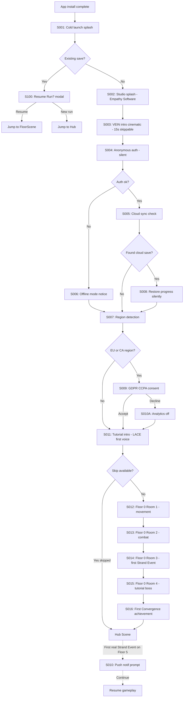

# STRAND — User Flow — Scope 1: First-Launch Flow

**Screens:** S001-S016, S100
**Orchestration:** [STRAND — User Flow — 00 Orchestration.md](STRAND%20—%20User%20Flow%20—%2000%20Orchestration.md)

> The player's first 5 minutes. Every decision here either creates a Day-2 returning player or loses them forever.

---

## Flow Diagram

---

## Screen Inventory

Each screen specified with: **Purpose, Entry, Exit, Analytics, Edge cases.**
See the full inventory in the source document body — this scope covers screens **S001–S016** plus **S100** (Resume Run modal).
