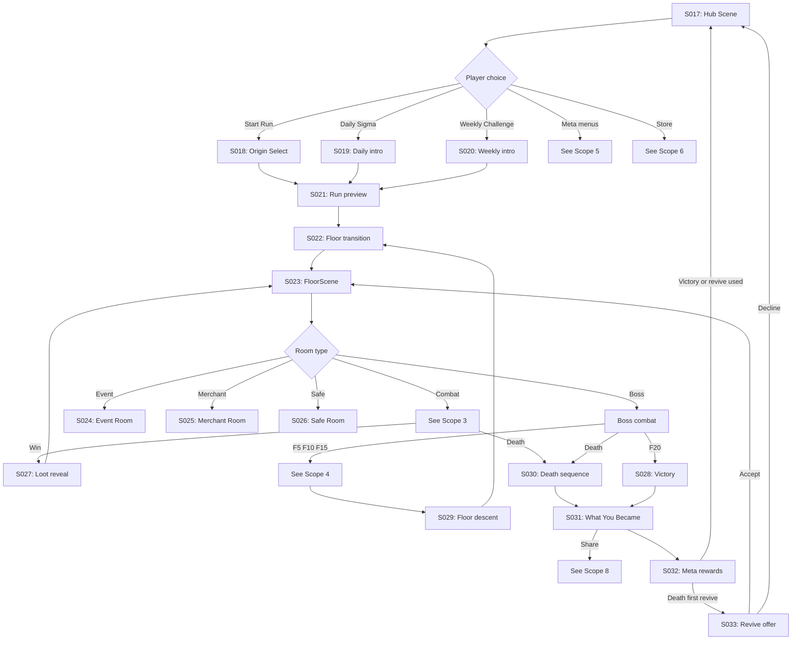

# STRAND — User Flow — Scope 2: Core Run Loop

**Screens:** S017-S033
**Orchestration:** [STRAND — User Flow — 00 Orchestration.md](STRAND%20—%20User%20Flow%20—%2000%20Orchestration.md)

> Players spend 95% of time inside this loop.

---

## Flow Diagram

---

## Screen Inventory

| ID    | Screen                      | Notes                                                                                                                                                                |
| ----- | --------------------------- | -------------------------------------------------------------------------------------------------------------------------------------------------------------------- |
| S017  | Hub Scene                   | Main menu between runs                                                                                                                                              |
| S018  | Origin Select               | Choose starting Origin                                                                                                                                              |
| S019  | Daily Sigma intro           | Today's seed and modifier                                                                                                                                           |
| S020  | Weekly Challenge intro      | Week's challenge brief                                                                                                                                              |
| S021  | Run preview                 | Confirm seed, modifiers, Strains                                                                                                                                    |
| S022  | Floor transition            | 1s mask while floor generates async                                                                                                                                 |
| S023  | FloorScene                  | Tile-based exploration (**THE game**)                                                                                                                               |
| S024  | Event Room                  | Story choice modal (3 options)                                                                                                                                      |
| S025  | Merchant Room               | VC-priced item shop, 1 ad refresh per merchant                                                                                                                      |
| S026  | Safe Room                   | Heal 25% max HP + save + LACE moment                                                                                                                                |
| S027  | Loot reveal                 | Drop animation after combat                                                                                                                                         |
| S028  | Victory sequence            | Floor 20 final boss celebration                                                                                                                                     |
| S029  | Floor descent               | Post-Strand Event narration, LACE mood may shift                                                                                                                    |
| S030  | Death sequence              | 3-sec death animation. `death_cause` enum (**locked**): `enemy_kill`, `boss_kill`, `hazard`, `status_tick`, `surrender`, `mutation_backfire`                        |
| S031  | Run summary "What You Became" | Portrait + name + share CTA                                                                                                                                       |
| S032  | Meta rewards                | SC granted, achievements popped                                                                                                                                     |
| S033  | Revive offer                | Watch ad or 75 SC; shown **AFTER share** to protect emotional moment                                                                                                |
