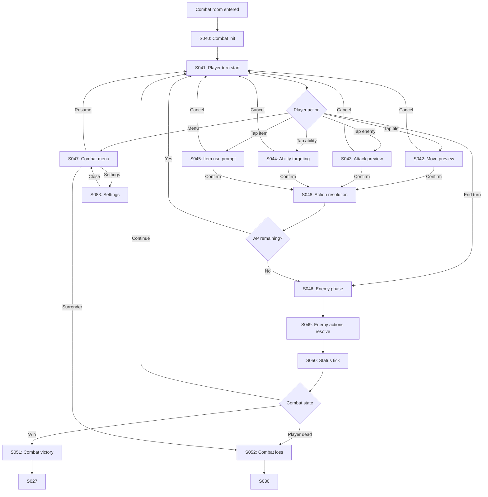

# Strand Descent — User Flow — Scope 3: Combat Sub-Flow

**Screens:** S040-S052
**Orchestration:** [Strand Descent — User Flow — 00 Orchestration.md](Strand%20Descent%20—%20User%20Flow%20—%2000%20Orchestration.md)

---

## Flow Diagram

---

## Screen Inventory

| ID   | Screen                  | Notes                                                                                                                                                  |
| ---- | ----------------------- | ------------------------------------------------------------------------------------------------------------------------------------------------------ |
| S040 | Combat init             | Reveal enemies, telegraph first moves                                                                                                                  |
| S041 | Player turn start       | AP refresh, saves `RunState` on entry                                                                                                                  |
| S042 | Move preview            | Path + AP cost. **Two-tap confirm for first 5 runs** (MetaState flag); single-tap thereafter. Toggleable in S093.                                      |
| S043 | Attack preview          | Damage range + accuracy                                                                                                                                |
| S044 | Ability targeting       | Range overlay, AoE preview                                                                                                                             |
| S045 | Item use prompt         | Confirm consumable use                                                                                                                                 |
| S046 | Enemy phase trigger     |                                                                                                                                                        |
| S047 | Combat menu             | Resume / Surrender / Settings. **NO FLEE in v1.** Surrender requires double-confirm.                                                                   |
| S048 | Action resolution       | **Determinism rule:** same input = same result                                                                                                         |
| S049 | Enemy actions resolve   | Sequentially with delays. Tap-to-fast-forward (**2x cap**). Auto-fast after 20 runs of player history.                                                 |
| S050 | Status tick             | Burn / poison / regen. Can kill → `death_cause: status_tick`                                                                                           |
| S051 | Combat victory          | Flash + XP gain, dismisses 1.5s                                                                                                                        |
| S052 | Combat loss             | Triggers S030 Death sequence                                                                                                                           |
