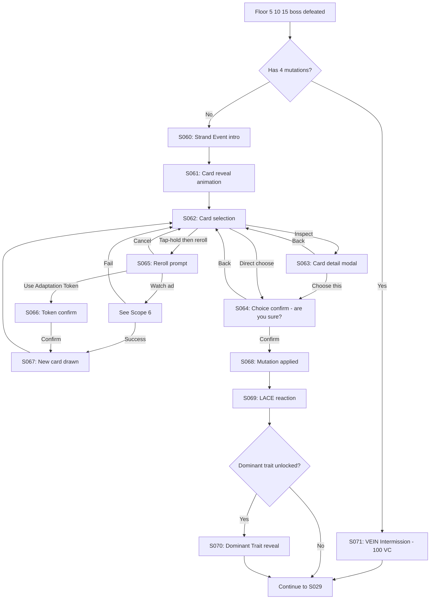

# Strand Descent — User Flow — Scope 4: Strand Event Sub-Flow

**Screens:** S060-S071
**Orchestration:** [Strand Descent — User Flow — 00 Orchestration.md](Strand%20Descent%20—%20User%20Flow%20—%2000%20Orchestration.md)

---

## Flow Diagram

---

## Screen Inventory

| ID   | Screen                       | Notes                                                                                                                                                                  |
| ---- | ---------------------------- | ---------------------------------------------------------------------------------------------------------------------------------------------------------------------- |
| S060 | Strand Event intro           | LACE narrates, **not skippable on first per run**                                                                                                                      |
| S061 | Card reveal animation        | Cards flip in (~1.5s), **deterministic per seed**                                                                                                                      |
| S062 | Card selection               | Main interaction, **no timer**, dwell as long as wanted                                                                                                                |
| S063 | Card detail modal            | Full effect text + family lore + synergy hints                                                                                                                         |
| S064 | Choice confirm               | Skipped after first 3 confirms in player history                                                                                                                       |
| S065 | Reroll prompt                | **PLAYER PICKS which card to reroll** (tap-and-hold first). **Only 1 reroll per Strand Event.**                                                                        |
| S066 | Token confirm                | Shows token balance                                                                                                                                                    |
| S067 | New card drawn               | Animate replacement, **same RNG sub-stream**                                                                                                                           |
| S068 | Mutation applied             | Visual transform, player geometry updates                                                                                                                              |
| S069 | LACE reaction                | Mood-aware comment; LACE mood may shift here                                                                                                                           |
| S070 | Dominant Trait reveal        | Big celebration; **first time grants achievement**                                                                                                                     |
| S071 | VEIN Intermission (NEW)      | Replaces Strand Event when player has **4 mutations (max)**. Grants 100 VC + LACE saturation line.                                                                     |
