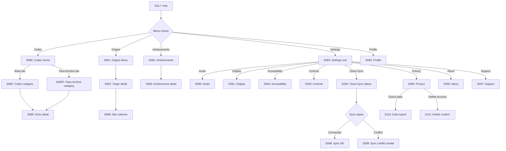

# Strand Descent — User Flow — Scope 5: Meta-Progression Screens

**Screens:** S080–S111
**Orchestration:** [Strand Descent — User Flow — 00 Orchestration.md](Strand%20Descent%20—%20User%20Flow%20—%2000%20Orchestration.md)

---

## Flow Diagram

---

## Screen Inventory

| ID    | Screen                     | Notes                                                                                                                                       |
| ----- | -------------------------- | ------------------------------------------------------------------------------------------------------------------------------------------- |
| S080  | Codex Home                 | Two top-level tabs: **Codex** (base 80 entries) and **Pass Archive** (Pass-only bonus entries). Each tab shows its own % completion bar. Base codex 100% is achievable without subscribing (per DR-006b). |
| S081  | Origins Menu               | Locked + unlocked Origins                                                                                                                   |
| S082  | Achievements list          | Sortable. "Complete the Codex" achievement references **base codex only**.                                                                  |
| S083  | Settings root              | Category navigation                                                                                                                         |
| S084  | Profile                    | Lifetime stats; last 10 organisms + Hall of Fame top 3 pinned. **Gallery capped at ~50KB/user.**                                            |
| S085  | Codex category             | Base-codex categories (lore / mutations / enemies / items / places). Locked entries **BLURRED (not hidden)**.                               |
| S085P | Pass Archive category      | Pass-only bonus entries (~10 per season). Visible to non-subscribers as preview with **subscribe CTA**; never counts toward base codex 100%. |
| S086  | Codex entry detail         | Full entry text. Same screen for base and Pass Archive entries.                                                                            |
| S087  | Origin detail              | Locked shows requirement; unlocked shows "Use" CTA.                                                                                         |
| S088  | Origin skin selector       | **Per DR-006a:** Pass subscribers see the full skin library. Skins for **already-unlocked Origins** activate immediately. Skins for **not-yet-unlocked Origins** display in a **"Preview"** state (visible, named, with label *"Unlocks when you reach this Origin"*) — never "Locked" framing. Non-subscribers see free skins in color + Pass skins greyed with "Pass" badge + preview + subscribe CTA. |
| S089  | Achievement detail         | "X of Y" progress bar                                                                                                                       |
| S090  | Audio                      | Music / SFX / Ambient sliders, live preview                                                                                                 |
| S091  | Display                    | Brightness, color blindness, motion                                                                                                         |
| S092  | Accessibility              | Cognitive load mode, dyslexia font, font size, motion reduce (per GDD §17)                                                                  |
| S093  | Controls                   | Confirm-tap toggle, animation speed                                                                                                         |
| S094  | Cloud Sync status          | Last-sync timestamp. Sync via iCloud / Play Games (TDD §10.1).                                                                              |
| S095  | Privacy                    | **GDPR/CCPA mandatory entry point**                                                                                                         |
| S096  | About + licenses           | Lists every royalty-free audio license                                                                                                      |
| S097  | Support / contact          |                                                                                                                                             |
| S098  | Sync OK                    |                                                                                                                                             |
| S099  | Sync conflict modal        | Triggered **only if contradictory** (`lifetime_runs` differs >5 OR currency differs >100); additive conflicts auto-merge                    |
| S110  | Data export confirm        | Hashed UID only via Cloud Function                                                                                                          |
| S111  | Delete account             | **7-day soft delete**, hard delete via scheduled Cloud Function                                                                             |
