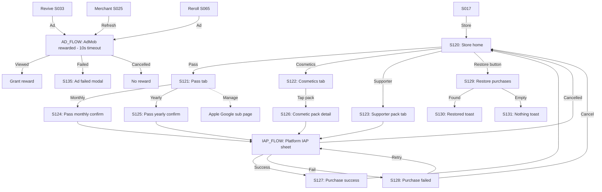

# Strand Descent — User Flow — Scope 6: Monetization Flows

**Screens:** S120-S135
**Orchestration:** [Strand Descent — User Flow — 00 Orchestration.md](Strand%20Descent%20—%20User%20Flow%20—%2000%20Orchestration.md)

---

## Flow Diagram

---

## Screen Inventory

| ID       | Screen                       | Notes                                                                                                       |
| -------- | ---------------------------- | ----------------------------------------------------------------------------------------------------------- |
| S120     | Store home                   | Tabs Pass / Cosmetics / Supporter; **Restore always visible**                                               |
| S121     | Pass tab                     | Existing subscriber sees "Manage" instead of "Subscribe"                                                    |
| S122     | Cosmetics tab                | Pass subscribers see Pass items with "Included" badge                                                       |
| S123     | Supporter pack               | One-time, locks to "owned"                                                                                  |
| S124     | Pass monthly confirm         | $4.99/mo, full terms + auto-renewal                                                                         |
| S125     | Pass yearly confirm          | $39.99/yr, shows savings                                                                                    |
| S126     | Cosmetic pack detail         | Carousel of visuals                                                                                         |
| S127     | Purchase success             | **Server-side validation before grant**                                                                     |
| S128     | Purchase failed              | 3 retries within 10 min, then force dismiss                                                                 |
| S129     | Restore purchases            | Loading state until response                                                                                |
| S130     | Restored toast               | Auto-dismiss 3s                                                                                             |
| S131     | Nothing to restore toast     | Auto-dismiss 3s                                                                                             |
| AD_FLOW  | AdMob rewarded ad            | **10s timeout, never blocks gameplay, max 3 ads per run hard cap**                                          |
| S135     | Ad failed modal              | **NO REWARD on failure** (no goodwill grant); **no retry button** (graceful degradation)                    |

---

## AMENDMENT — DR-010 / DR-011 (2026-06-09)

- **S033 Revive (Scope 2):** rewarded-ad only — the 75-SC path is removed (DR-010). Offer hidden when no ad available (E030/E031).
- **VEIN pack:** confirmed non-existent — VEIN Crystals are never purchasable (DR-010); no store surface may reference one.
- **Pass price:** S124 $4.99/mo, S125 $39.99/yr confirmed locked (DR-010).
- **S123 Supporter Pack — now defined (DR-011):** "First Descent" Supporter Pack, **$9.99 one-time**. Grants: exclusive supporter share frame + exclusive run-end title card + LACE thank-you Codex entry. Purely cosmetic/lore. Locks to "owned"; restorable via S129.
