# Strand Descent — User Flow — Scope 7: Edge Cases

**IDs:** E001-E052
**Orchestration:** [Strand Descent — User Flow — 00 Orchestration.md](Strand%20Descent%20—%20User%20Flow%20—%2000%20Orchestration.md)

> Edge cases are **not screens**; they are specified behaviors for failure paths. Each has a stable ID referenced from TDD and analytics.

---

## Category Diagram

```mermaid
flowchart TD
    EDGE[Edge case categories]
    EDGE --> NET[Network]
    EDGE --> APP[App lifecycle]
    EDGE --> SAVE[Save and sync]
    EDGE --> AD[Ad failures]
    EDGE --> IAP[IAP failures]
    EDGE --> PERF[Performance]

    NET --> E001[E001: No network at launch]
    NET --> E002[E002: Network lost mid-session]
    NET --> E003[E003: Network restored]
    APP --> E010[E010: App suspended mid-turn]
    APP --> E011[E011: App killed by OS]
    APP --> E012[E012: Low memory warning]
    APP --> E013[E013: Phone call during run]
    SAVE --> E020[E020: Save write fail]
    SAVE --> E021[E021: Save corruption]
    SAVE --> E022[E022: Sync conflict]
    SAVE --> E023[E023: Cloud quota exceeded]
    AD --> E030[E030: Ad load timeout]
    AD --> E031[E031: Ad cancelled mid-watch]
    AD --> E032[E032: Ad cap reached]
    IAP --> E040[E040: IAP region mismatch]
    IAP --> E041[E041: Receipt validation fail]
    IAP --> E042[E042: Pending subscription]
    IAP --> E043[E043: Refund issued]
    PERF --> E050[E050: Frame rate drops]
    PERF --> E051[E051: Floor gen over 1s]
    PERF --> E052[E052: Battery low warning]
```

---

## Edge Case Inventory

### Network

| ID    | Case                       | Behavior                                                                 |
| ----- | -------------------------- | ------------------------------------------------------------------------ |
| E001  | No network at launch       | Auth 5s timeout, offline mode, toast once                                |
| E002  | Network lost mid-session   | Queue writes locally, no popup                                           |
| E003  | Network restored           | Drain queue, refresh Remote Configs                                      |

### App Lifecycle

| ID    | Case                       | Behavior                                                                 |
| ----- | -------------------------- | ------------------------------------------------------------------------ |
| E010  | App suspended mid-turn     | Save `RunState` immediately, exact resume                                |
| E011  | App killed by OS           | S100 Resume modal at next launch                                         |
| E012  | Low memory warning         | Free non-essential caches, no UI                                         |
| E013  | Phone call during run      | Same as E010                                                             |

### Save & Sync

| ID    | Case                  | Behavior                                                                                                                  |
| ----- | --------------------- | ------------------------------------------------------------------------------------------------------------------------- |
| E020  | Save write fail       | Retry 3x backoff, then modal                                                                                              |
| E021  | Save corruption       | Auto-restore from last good save (**3 generations**); silent if <24h old, toast if older                                  |
| E022  | Sync conflict         | Auto-merge if additive; modal S099 if contradictory (`lifetime_runs` differs >5 OR currency differs >100)                 |
| E023  | Cloud quota exceeded  | Write to local only, "pending space" toast                                                                                |

### Ad Failures

| ID    | Case                       | Behavior                                                                 |
| ----- | -------------------------- | ------------------------------------------------------------------------ |
| E030  | Ad load timeout            | Return null reward, show S135                                            |
| E031  | Ad cancelled mid-watch     | Null reward, no popup                                                    |
| E032  | Ad cap reached (3 per run) | Hide ad buttons, show SC alternative                                     |

### IAP Failures

| ID    | Case                       | Behavior                                                                                                                |
| ----- | -------------------------- | ----------------------------------------------------------------------------------------------------------------------- |
| E040  | IAP region mismatch        | "Not available in your region" modal                                                                                    |
| E041  | Receipt validation fail    | 3 retries server-side, then block + log (**Director weekly email digest**)                                              |
| E042  | Pending subscription       | Lock Pass features until resolved                                                                                       |
| E043  | Refund issued              | Pass instant revoke; one-time IAPs kept                                                                                 |

### Performance

| ID    | Case                       | Behavior                                                                 |
| ----- | -------------------------- | ------------------------------------------------------------------------ |
| E050  | Frame rate drops <30fps    | Modal **once per major version** (v1.x, v2.x)                            |
| E051  | Floor gen >1s              | Extend transition mask, log slow seed                                    |
| E052  | Battery low warning        | Auto-pause if in combat, toast                                           |
