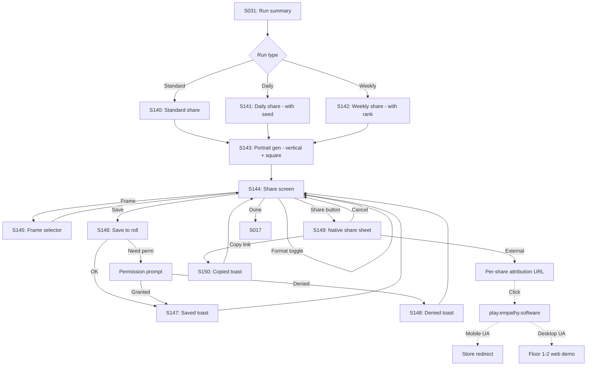

# Strand Descent — User Flow — Scope 8: Share Flow

**Screens:** S140-S150 + ATTR + LANDING
**Orchestration:** [Strand Descent — User Flow — 00 Orchestration.md](Strand%20Descent%20—%20User%20Flow%20—%2000%20Orchestration.md)

---

## Flow Diagram

---

## Screen Inventory

| ID       | Screen                       | Notes                                                                                                                |
| -------- | ---------------------------- | -------------------------------------------------------------------------------------------------------------------- |
| S140     | Standard share screen        |                                                                                                                      |
| S141     | Daily Sigma share            | Shows global rank if leaderboard cached                                                                              |
| S142     | Weekly Challenge share       | Top-100 status badge if applicable                                                                                   |
| S143     | Portrait generation          | **1080×1920 vertical AND 1080×1080 square** client-side; skeleton if >2s                                             |
| S144     | Share screen                 | Format tab (Vertical / Square); subtle "More frames →" link for non-Pass holders                                     |
| S145     | Frame selector               | Pass frames blurred for non-subs + CTA                                                                               |
| S146     | Save to camera roll          | iOS requires Photo Add permission                                                                                    |
| S147     | Saved toast                  | Auto-dismiss 2s                                                                                                      |
| S148     | Permission denied            | Deep-links to OS Settings app                                                                                        |
| S149     | Native share sheet           | OS-handled app list, we don't curate                                                                                 |
| S150     | Link copied toast            | Auto-dismiss 2s                                                                                                      |
| ATTR     | Attribution URL              | Per-share unique URL via **Branch.io free tier** (up to 10K MAU); above that, evaluate paid Branch or custom         |
| LANDING  | Web landing page             | Smart redirect by user-agent — mobile UA → store redirect; desktop UA → Floor 1-2 web demo                           |
